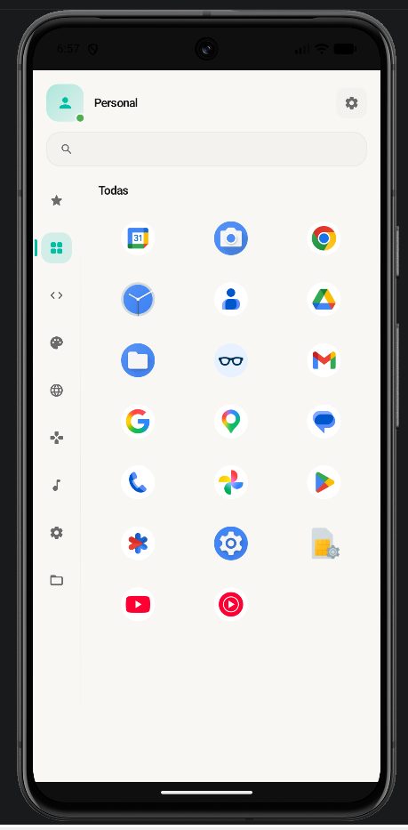
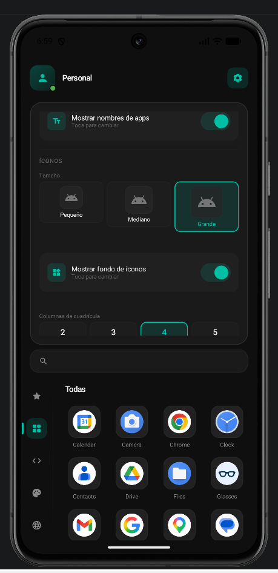

# TAPO-Launcher


Launcher para Android hecho con **Kotlin + Jetpack Compose**. Busca ser ligero, minimalista y práctico para uso diario, con soporte para categorías, perfiles de trabajo, icon packs y ajustes visuales.

<p align="center">
  
  
  
</p>

## Características

- **Categorías configurables** — Favoritos, Desarrollo, Gráficos, Internet, Juegos, Multimedia, Sistema y Utilidades.
- **Categorías inteligentes** — Agrupación automática para Wallets, Compras, Finanzas y Dev.
- **Perfiles Personal / Trabajo** — Detecta un Work Profile real y permite lanzar apps del perfil laboral.
- **Apps ocultas** — Oculta apps permanentemente o temporalmente con persistencia en DataStore.
- **Menú contextual** — Long-press en cualquier app abre un menú flotante con acciones: Favorito, Mover, Información, Desinstalar.
- **Búsqueda instantánea** — Filtra apps por nombre o paquete.
- **Ajustes de interfaz** — Tema claro/oscuro, tamaño de íconos, columnas, fondo de íconos y etiquetas.
- **Icon packs** — Detecta packs instalados y resuelve íconos desde su `appfilter.xml`.
- **Personalización de categorías** — Cambia nombre, ícono y visibilidad de cada categoría.
- **Temas de color** — Incluye paletas adicionales como Dracula, Tokyo Night, Nord y más.
- **TAPO Labs** — Auto-organización experimental de apps con IA (Groq, Gemini, Cohere).
- **Notificaciones** — Integración con `NotificationListenerService` para mostrar estado de notificaciones.

## Tech stack

| Capa | Tecnología |
|------|-----------|
| Lenguaje | **Kotlin** 100% |
| UI | **Jetpack Compose** + Material3 |
| Arquitectura | **MVVM** + Use Cases + contenedor manual de dependencias |
| Gradle | **Kotlin DSL** + Version Catalog |
| Mínimo SDK | **API 26** (Android 8.0) |
| Target SDK | **API 35** (Android 15) |
| Compilación | Java 17, Compose BOM |

## Build

```bash
cd app

# Debug APK
./gradlew assembleDebug

# Release APK (requiere keystore configurada)
./gradlew assembleRelease
```

El APK generado estará en `app/app/build/outputs/apk/debug/` o `app/app/build/outputs/apk/release/`.

## Licencia

[Apache License 2.0](LICENSE)

## Privacidad y Permisos

Consulta el documento de [Permisos y Privacidad](PERMISSIONS.md) para conocer la justificación del uso del permiso `QUERY_ALL_PACKAGES` y otros permisos requeridos.
